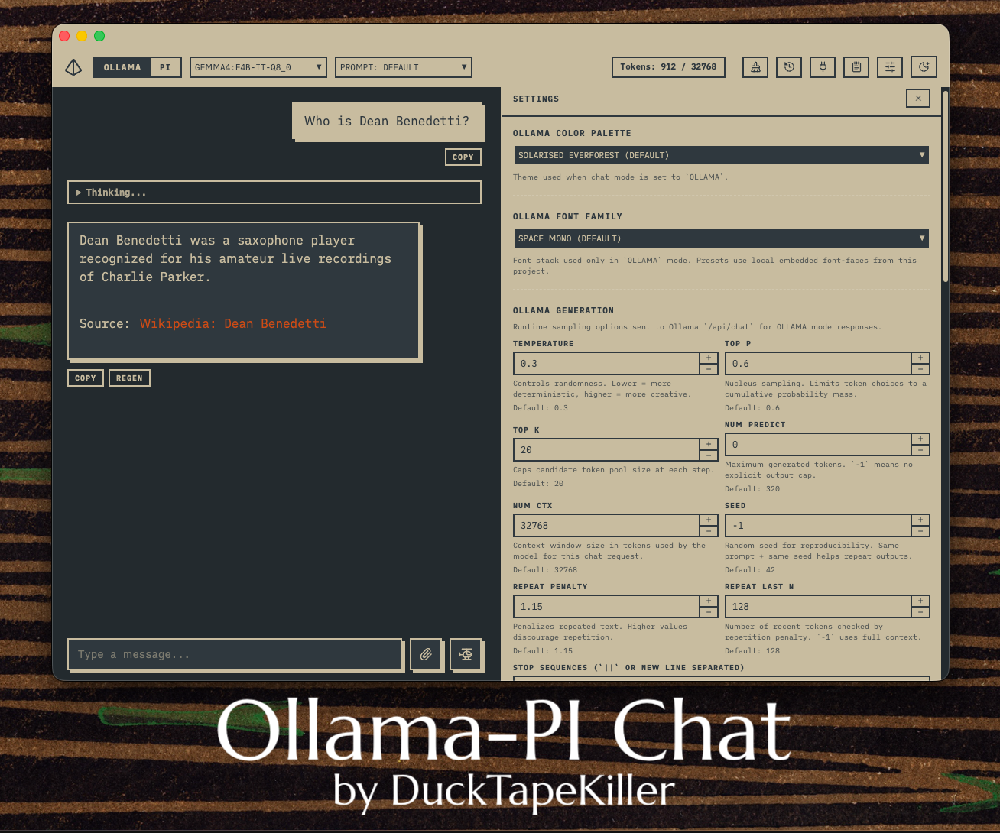

# Ollama Pi Chat



## A Beautiful, Secure, & Local-First Web Interface for Ollama, Pi, and Cloud Models

Welcome to **Ollama Pi Chat**! This is a local-first desktop wrapper and web application that gives you a gorgeous, retro-brutalist chat interface to interact with local AI models, agent systems, and optional cloud model providers.

The core chat server and desktop wrapper run directly on your macOS machine. **Offline Ollama chat does not require an internet connection.** Pi mode runs through your local Pi CLI. Cloud mode is optional and only contacts the provider you configure. Optional web/MCP/shell skills can contact external services or run local commands only when enabled and invoked, so review those settings before using them with sensitive prompts.

> [!IMPORTANT]
> **macOS Gatekeeper Warning**: The developer of this project does not have a paid Apple Developer Account, so the pre-built desktop applications and binaries are not digitally signed.
> When running the packaged app for the first time, macOS Gatekeeper will block execution or show a warning. Please refer to the [Troubleshooting Common Issues](#-troubleshooting-common-issues) section for simple, standard instructions on how to bypass this.

---

## Table of Contents

1. [What is Ollama Pi Chat?](#-what-is-ollama-pi-chat)
2. [The Three Chat Modes Explained](#-the-three-chat-modes-explained)
3. [Core Features Tour](#-core-features-tour)
4. [Requirements & Downloads](#-requirements--downloads)
5. [How to Run & Install (Choose Your Path)](#-how-to-run--install-choose-your-path)
6. [Understanding the Settings Panel](#-understanding-the-settings-panel)
7. [Privacy, Security, & Where Data is Stored](#-privacy-security--where-data-is-stored)
8. [Troubleshooting Common Issues](#-troubleshooting-common-issues)
9. [Pre-publishing Checks (For Developers)](#-pre-publishing-checks-for-developers)

---

## What is Ollama Pi Chat?

For non-technical users, think of Ollama Pi Chat as a **private control deck for Artificial Intelligence**. You can keep work fully local with Ollama, use Pi for terminal-grade agent tasks, or intentionally switch to Cloud mode when you want to use your own provider API keys.

It combines **three powerful systems** under one beautiful user interface:

- **Ollama**: An engine that runs massive AI models on your local hardware.
- **Pi**: An agent system that can perform actions (like read files, write files, search local directories, and run terminal scripts).
- **Cloud**: A direct chat mode for provider APIs such as OpenAI, Anthropic Claude, and Mistral.

---

## The Three Chat Modes Explained

You can toggle between the three modes instantly using the icon switch at the top-left of the application bar.

```
┌──────────────────────────────────────────────┐
│  [ Ollama icon ] [ Pi icon ] [ Cloud icon ]  │
└──────────────────────────────────────────────┘
```

### 1. Ollama Mode (Pure Offline Chat)

In Ollama Mode, the app speaks directly to your local Ollama installation.

- **Best for**: Standard chat, brainstorming, editing text, asking general knowledge questions, translating languages, or rewriting documents.
- **How it works**: Select any model you have downloaded (e.g., `llama3`, `mistral`, `phi3`) from the top drop-down menu and type your prompt. It streams the response word-by-word.
- **Reasoning/Thinking Support**: If you select a reasoning model (like `deepseek-r1`) that outputs chain-of-thought processing, the app renders the AI's internal thoughts in a beautiful, collapsible details box so it doesn't clutter your chat history.

### 2. Pi Mode (Agent-Driven Execution)

In Pi Mode, the app acts as a secure bridge to the **Pi agent command-line tool**.

- **Best for**: Complex automation, programming tasks, searching local project folders, reviewing codebase directories, or performing system actions.
- **Interactive Browser Permissions (The Security Guards)**: When Pi runs a tool to modify files, run command terminal lines, or query sensitive folders, it requests permission. Ollama Pi Chat captures this request and pops up a clear, non-technical interactive dialog in your browser. You can **Allow**, **Deny**, input custom variables, or edit the command before it runs. This prevents the command-line tool from silently hanging or executing unauthorized actions on your machine.
- **Live Status**: The title bar can show the active Pi model, state, cost label, and thinking level when your Pi CLI exposes those values through RPC.

### 3. Cloud Mode (Bring Your Own API Key)

In Cloud Mode, the app sends chat requests directly from the local server to the cloud provider you configure.

- **Best for**: Using hosted models when you want higher capacity, a specific provider model, or a fallback when local models are not enough.
- **Supported providers**: OpenAI, Anthropic Claude, and Mistral.
- **How it works**: Open Settings, choose the Cloud provider, paste your API key, set the model id, and save. Then switch to the Cloud icon in the top-left mode selector and chat normally.
- **Privacy note**: Cloud prompts and uploaded text are sent to the selected provider. Use Ollama or Pi mode for workflows that must remain fully local.

---

## Core Features Tour

Ollama Pi Chat is packed with premium, user-friendly utilities:

- **Unified Responsive Design**: Responsive brutalist grid layouts with smooth transitions, customized fonts, and visual hover effects.
- **Native MCP Support**: Full Model Context Protocol (MCP) integration. Click the plug icon to instantly connect local MCP servers (like Memory, Filesystem, or SQLite) directly to your Ollama models.
- **Auto-Saving Notes Panel**: Click the **Notes** icon on the top right to slide open a dedicated notepad. Type notes, cheat sheets, or drafts; the app autosaves them directly to your browser's memory, persisting them even if you refresh the page.
- **Smart File Uploader**: Drag or select documents (like `.txt`, `.md`, `.json`, `.py`, `.js`, `.css`, etc.). The app extracts and loads the text into your prompt box. If you upload a `.pdf` file, the app automatically runs local text extraction utility (`pdftotext`) to ingest it.
- **Cloud Mode**: Use OpenAI, Anthropic Claude, or Mistral models with your own API keys while keeping the app UI, history, and settings local.
- **System Prompt Overlays Manager**: Click **Settings** and scroll to "Custom Overlay Prompt" to create templates (like a translation assistant, code reviewer, or copy editor). You can switch between system personalities instantly using the top bar selector.
- **Conversation History**: Reload, manage, or clear past chat sessions from the historical drawer on the left side.
- **Log Auditing**: The application maintains a health log of system start times, timeout issues, and a detailed audit of every permission you granted or denied in Pi mode.

---

## Requirements & Downloads

To run this application locally, you will need a few simple components installed on your Mac:

1. **Node.js (Version 20+)**: The engine that hosts the local server. Download the "LTS" version from the official [Node.js Website](https://nodejs.org).
2. **Ollama**: The application that manages and runs AI models. Download it from the [Ollama Website](https://ollama.com).
   - Once installed, open your Mac Terminal application and download a model by running:
     ```bash
     ollama run llama3
     ```
3. **Pi CLI (Only required for Pi Mode)**: The agent execution engine. Make sure the `pi` command is installed and accessible in your environment PATH.
4. **Cloud Provider API Key (Only required for Cloud Mode)**: Bring an API key from OpenAI, Anthropic, or Mistral if you want to use hosted models.
5. **pdftotext (Optional - for PDF uploads)**: To extract and read PDF uploads, install it via Homebrew:
   ```bash
   brew install poppler
   ```

---

## How to Run & Install (Choose Your Path)

Depending on your technical comfort level, select one of the following methods to start using the app.

---

### Path A: The Simple Startup (Great for Regular Users)

1. Open your Mac **Terminal** application (found in Applications > Utilities).
2. Navigate to the folder where you unpacked this project:
   ```bash
   cd "/path/to/ollama-pi-chat"
   ```
3. Make the launcher script executable (only needed the first time):
   ```bash
   chmod +x run.sh
   ```
4. Run the script:
   ```bash
   ./run.sh
   ```

- **What this does**: The script tests your Node environment, checks if Ollama is running in the background, starts the local server, and automatically opens your web browser to `http://127.0.0.1:8080` where the chat interface is ready to use!

---

### Path B: Install as a macOS Desktop App (`.app`)

If you want a native, clickable Mac app icon in your Dock that behaves like any other program:

1. Open terminal in the project directory and install the necessary helper modules:
   ```bash
   cd "/path/to/ollama-pi-chat"
   npm install
   ```
2. Build the application wrapper:
   ```bash
   npm run build:app
   ```
3. Open the newly created `release` folder:
   - You will find `Ollama Pi Chat.app` inside. You can drag this to your Mac's `Applications` folder!
   - _Note: Since this build is local and unsigned by Apple Developer credentials, the first time you run it, macOS Gatekeeper may warn you. Right-click the app icon and select "Open" to bypass this validation._
4. The Desktop app will automatically launch its server in the background and open the user interface.

---

### Path C: Register as an Always-On Background Service

If you want the Ollama Pi Chat server to start automatically whenever you turn on your Mac (without needing to keep a terminal window open):

1. Compile the standalone binary first (Path D) so it creates the binary at `dist/ollama-pi-chat`.
2. Run the registration script in terminal:
   ```bash
   chmod +x install-launchagent.sh
   ./install-launchagent.sh
   ```

- **How it works**: This creates a macOS LaunchAgent plist at `~/Library/LaunchAgents/com.user.ollamapichat.plist`. The server now boots silently at login and listens securely at `http://127.0.0.1:8080`.
- **To stop the service later**, run:
  ```bash
  launchctl bootout "gui/$UID/com.user.ollamapichat"
  ```
- **To restart the service later**, run:
  ```bash
  launchctl bootstrap "gui/$UID" "$HOME/Library/LaunchAgents/com.user.ollamapichat.plist"
  ```

---

### Path D: Standalone Compilation (For Advanced Users)

You can package Node.js, the local server code, and the frontend web pages into a **single, standalone binary file** with zero external runtime folder dependencies:

1. In the terminal, run:
   ```bash
   chmod +x build-sea.sh
   ./build-sea.sh
   ```
2. **Output**: A single executable binary file at `dist/ollama-pi-chat`.
3. You can copy this executable file anywhere on your Mac and double-click or run it directly:
   ```bash
   ./dist/ollama-pi-chat
   ```

---

## Understanding the Settings Panel

Click the slider icon (**Settings**) in the top right to configure your system. Here is a breakdown of what these settings mean in plain English:

### 1. Appearance & Presets

- **Ollama/Pi/Cloud Color Palette**: Swap between custom-designed color schemes. Different palettes can be set for each mode so you instantly know which mode is active.
- **Ollama/Pi/Cloud Font Family**: Change the typography style of the chat messages. You can use standard monospaced fonts, serif fonts, or type in a custom font installed on your system.

### 2. AI Sampling Sliders (Ollama Generation Options)

These parameters let you control the "personality" and behavior of the local Ollama models:

| Setting                      | What it does                                                                     | Lower Value                                                                                        | Higher Value                                                                                                | Default   |
| :--------------------------- | :------------------------------------------------------------------------------- | :------------------------------------------------------------------------------------------------- | :---------------------------------------------------------------------------------------------------------- | :-------- |
| **Temperature**              | Controls the randomness or creativity of responses.                              | **0.0 - 0.2**: Highly precise, factual, repetitive. Ideal for math, coding, and strict guidelines. | **1.0 - 1.5**: Highly creative, variable, expressive. Ideal for brainstorming or writing fiction.           | **0.3**   |
| **Top P**                    | Nucleus sampling. Filters candidate words based on their cumulative probability. | **0.1**: The model will only choose from the most obvious words.                                   | **0.9**: Allows the model to pick slightly rarer words, making it more interesting.                         | **0.6**   |
| **Top K**                    | Limits the model's vocabulary choice to the _K_ most probable next words.        | **10**: Highly predictable vocabulary.                                                             | **100**: Richer, more diverse vocabulary.                                                                   | **20**    |
| **Repeat Penalty**           | Punishes the model for repeating the exact same phrases.                         | **1.0**: No penalty. Might loop or repeat.                                                         | **1.5**: Strong penalty. Forces the AI to find alternative wording.                                         | **1.15**  |
| **Context Window (num_ctx)** | The AI's short-term memory limit (including prompt and response history).        | **2048**: Fast response times, but forgets earlier details quickly.                                | **32768 - 131072**: Can remember entire uploaded books or long codebases, but consumes more RAM/GPU memory. | **32768** |

### 3. Pi Configuration Settings

- **Pi Command Path**: If your system has multiple installations of the Pi tool, you can paste the exact file path here (e.g., `/usr/local/bin/pi`).
- **Pi Working Directory**: The default directory where Pi runs code. By default, this is set to your storage directory.
- **Pi Timeout**: If Pi halts or waits on a task, this defines how long the system waits before automatically terminating the session.
- **Permission Policy**:
  - **Normal**: Prompts you for critical operations but automates standard lookups.
  - **Strict**: Hard-blocks root access, shortens decision timers, and prompts you for everything to ensure maximum security.

### 4. Built-in Agent Skills (Ollama)

Ollama Pi Chat comes with a suite of native tools that you can toggle on or off in the settings. When enabled, your local Ollama models can automatically invoke these skills to perform actions or look up real-time information:

- **Wikipedia**: Searches Wikipedia for factual information and summaries. Requires internet access.
- **Britannica**: Searches the Encyclopedia Britannica for curated facts. Requires internet access.
- **Wiktionary**: Looks up deep dictionary definitions. Requires internet access.
- **Deep Etymology**: Cross-references multiple multilingual etymological dictionaries (Etymonline, RAE, CNRTL, DeChile) to find word origins, cognates, and false friends. Requires internet access.
- **DuckDuckGo**: Performs general, privacy-respecting web searches for recent news and events. Requires internet access.
- **Web Scraper**: Extracts raw, readable text content from any provided web URL. Requires internet access.
- **Calculator**: Securely evaluates complex mathematical expressions.
- **Time & Date**: Retrieves the current local time, date, and day of the week, with support for global IANA timezones (e.g., `Australia/Sydney`).
- **Fact Check**: Fact-checks specific claims against multiple sources. Requires internet access.
- **Shell Command**: Executes bash terminal commands directly from the chat (requires explicit interactive confirmation for safety). Custom shell skills use the same confirmation gate.
- **Local Notes**: Allows the model to directly read from or append text to your persistent local notes file.

### 5. Cloud Mode Settings

- **Provider**: Choose OpenAI, Anthropic Claude, or Mistral.
- **API Key**: Paste your provider key. Keys are saved on disk by the local server and are never returned to the browser UI after saving.
- **Model**: Enter the exact model id you want to use for that provider.
- **Base URL**: Keep the provider default unless you use a compatible gateway or proxy.
- **Max Output Tokens**: Caps the maximum response length requested from the provider.

### 6. MCP (Model Context Protocol) Integration

Ollama Pi Chat fully supports connecting external **MCP Servers** to your local Ollama models.
Click the **Plug Icon** in the top title bar to open the MCP Panel. You can paste standard `mcpServers` JSON configuration directly into the box. The app will automatically parse your config, spin up the external servers in the background, map their tools, and dynamically render sleek plain-English badges (like `MEMORY`, `FILESYSTEM`) below the editor so you always know what tools are locked and loaded.

---

## Privacy, Security, & Where Data is Stored

Ollama Pi Chat is designed from the ground up to respect your digital sovereignty.

### Data Storage Locations

- **Local Storage Directory**: By default, all backend configuration and logs are kept in:
  ```
  /Users/your_username/ollama-pi-chat/
  ```
  Inside this folder, you will find:
  - `conversations.json`: Your entire chat history, locally cached.
  - `prompts.json`: Your custom overlay prompts.
  - `ui-settings.json`: Mode-specific palettes and font settings.
  - `cloud-settings.json`: Cloud provider settings and saved API keys. This file is written with owner-only permissions (`0600`) when possible.
  - `security-events.jsonl`: The security audit trace showing permission requests and execution logs.
  - `daemon.log` / `daemon.error.log`: Output logs when running the LaunchAgent background daemon.
- **Browser localStorage**: Browser-side fallbacks, active prompt selection, and some UI state are saved in the browser's sandbox storage (`localStorage`). Clearing your browser cache or storage may reset browser-only UI state.

### Cloud Mode Privacy

Cloud mode is intentionally not local-only. When you use Cloud mode, prompts, uploaded file text, and conversation context for that request are sent to the selected provider API. API keys are stored locally in `~/ollama-pi-chat/cloud-settings.json` or can be supplied through environment variables (`OPENAI_API_KEY`, `ANTHROPIC_API_KEY`, or `MISTRAL_API_KEY`).

### Network Safety Protections

The local Node.js server implements active security headers to protect your local system from web-based attacks:

1. **Origin Verification**: The server automatically rejects any inbound HTTP request whose `Host` or `Origin` header does not match the active local server port on `127.0.0.1` or `localhost`. This prevents malicious websites you visit in other tabs from talking to your local AI server.
2. **CSP (Content Security Policy)**: Blocks execution of injected scripts and strictly restricts style sheet, font, and connect sources.
3. **MIME Sniffing & Framing Protections**: Anti-clickjacking headers are applied to prevent the local chat interface from being framed by external sites.
4. **Root Block**: The server will immediately shutdown and refuse to boot if started as the root administrator user (`UID 0`).

---

## Troubleshooting Common Issues

### Error: `listen EADDRINUSE 127.0.0.1:8080`

- **What it means**: The network port `8080` is already occupied. This usually happens if an old instance of the Ollama Pi Chat server is still running in the background, or another application (like a development project) is using that port.
- **How to fix it**:
  1. Open terminal and find the process ID (PID) occupying the port:
     ```bash
     lsof -nP -iTCP:8080 -sTCP:LISTEN
     ```
  2. Kill the process (replace `<PID>` with the actual process number from step 1):
     ```bash
     kill -9 <PID>
     ```
  3. Alternatively, you can open `server.js` and change `DEFAULT_PORT = 8080` to an open port (e.g., `8082`).

### Models are not showing up in the selector

- **What it means**: Ollama Pi Chat cannot establish a connection with the local Ollama engine.
- **How to fix it**:
  1. Make sure the Ollama application is launched and running on your Mac.
  2. Check if Ollama is accessible by opening this URL in your web browser: [http://localhost:11434/api/tags](http://localhost:11434/api/tags).
  3. If you get a connection error, restart Ollama. If you get a blank list, open terminal and pull a model:
     ```bash
     ollama pull llama3
     ```

### PDF uploads are failing

- **What it means**: Your system is missing the text extractor utility.
- **How to fix it**:
  - Open terminal and install `poppler` (which contains `pdftotext`):
    ```bash
    brew install poppler
    ```
  - Confirm it is installed by running `which pdftotext`.

### Pi Mode hangs when I run a command

- **What it means**: Pi CLI is not installed or the permission prompt is waiting.
- **How to fix it**:
  1. Confirm the Pi tool is available by running `which pi` in terminal. If missing, check your Pi CLI setup path.
  2. Ensure the permissions extension (`@gotgenes/pi-permission-system`) is properly registered in your Pi runtime configurations.

### Cloud Mode says the API key is missing

- **What it means**: No key is saved for the selected provider, and no matching environment variable is available to the server.
- **How to fix it**:
  1. Open **Settings** and switch to the Cloud Mode section.
  2. Choose your provider, paste the API key, confirm the model id, and click **Save Cloud Settings**.
  3. Alternatively, start the server with `OPENAI_API_KEY`, `ANTHROPIC_API_KEY`, or `MISTRAL_API_KEY` set in the environment.

### "Ollama Pi Chat is damaged and cannot be opened" / macOS Gatekeeper Blocks App

- **What it means**: The developer of this project does not have a paid Apple Developer Account, so the packaged applications and binaries are unsigned. On newer macOS versions, Gatekeeper will automatically flag and block unsigned apps downloaded from the internet.
- **How to fix it**:
  1. Open your terminal application.
  2. Strip the quarantine attribute from the app (replace the path with where you moved the app, typically in Applications):
     ```bash
     xattr -cr "/Applications/Ollama Pi Chat.app"
     ```
  3. Alternatively, right-click (or Control-click) the application icon in Finder, select **Open**, and click **Open** on the dialog to confirm the exception.

---

## Pre-publishing Checks (For Developers)

Before committing modifications or publishing this folder to a shared repository:

1. **Clean Local Logs**: Ensure generated conversation lists or security events in `~/ollama-pi-chat` are not added to git history. The standard `.gitignore` file already excludes build folders and local storage.
2. **Remove Personal Paths**: Do not hardcode specific system paths (e.g., `/Users/your_name/`) or local developer API tokens.
3. **Verify Signatures**: If code modifications are made, SEA injection blobs must be compiled using thin mach-O binaries so codesign validation checks match. Run the clean export rsync command:
   ```bash
   mkdir -p "/path/to/ollama-pi-chat-github"
   rsync -a --delete \
     --exclude '.git' \
     --exclude 'node_modules' \
     --exclude 'release' \
     --exclude 'dist' \
     --exclude '.DS_Store' \
     --exclude '*.log' \
     --exclude '*.pid' \
     "/path/to/ollama-pi-chat/" "/path/to/ollama-pi-chat-github/"
   ```
