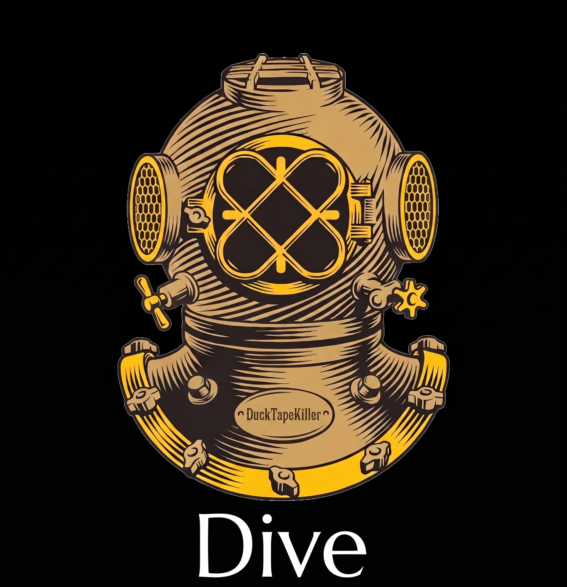

# Dive



## A Local-First Chat & Agent Interface for LM Studio, Ollama, Pi, llama.cpp, and Cloud Models

**Version 5.0.6**

Dive is a local-first desktop app (and web UI) with a flat, brutalist interface for working with local AI backends, terminal-grade agents, and — optionally — your own cloud API keys. The server and app run entirely on your machine; local modes need no internet at all.

> [!IMPORTANT]
> **macOS Gatekeeper**: the pre-built app is not code-signed (no paid Apple Developer account). On first launch macOS will block it — see [Troubleshooting](#troubleshooting) for the standard two-command fix.

---

## The Five Chat Modes

Switch instantly with the icon toggle in the top bar.

| Mode          | Backend                            | Best for                              |
| ------------- | ---------------------------------- | ------------------------------------- |
| **LM Studio** | local server (OpenAI-compatible)   | local models with native tool calling |
| **Ollama**    | local Ollama server                | offline chat, skills, agent workflows |
| **Pi**        | Pi coding-agent CLI (RPC)          | file/terminal agent tasks, subagents  |
| **Cloud**     | OpenAI, Anthropic, Mistral, Google | hosted models with your own keys      |
| **llama.cpp** | local `llama-server`               | bare-metal local inference            |

Every mode keeps its own conversations, palette, font, model choice, prompts, and database toggle — nothing bleeds between modes.

https://github.com/user-attachments/assets/ee4bdb68-7e68-4ccd-9783-31355823e891

---

## Interface

- **Side panel** (collapsible to an icon rail): shared model dropdown with refresh, Pi thinking-level control and live state, the per-mode **Database toggle** with a pulsing index-activity light and completion percentage, the last five conversations, and History / Settings / MCP / Notes buttons.
- **Top bar**: mode switcher, system-prompt selector, clear-chat, light/dark toggle.
- **Chat**: streaming responses; reasoning models get a collapsible **Thinking** box; agent runs show a **step timeline**, **live tool-progress panels** (web searches, subagent fleets update in place, like a terminal), an **Execution Trace**, retrieved **Passages**, and clickable **source pills** for every web source a skill used.
- **History keeps everything**: interrupted and failed turns are preserved (with their thinking and traces), checkpointed to disk continuously, and survive clearing the chat or restarting the app. All panels are resizable.
- **Appearance**: eight palettes in light and dark, all following the same low-contrast surface logic (near-shade backgrounds, one text color — easy on the eyes). Each mode has its own default palette and font, changeable per mode.

---

## Tool Calling & Skills

Ollama, LM Studio, and llama.cpp support **native tool calling (OpenAI schema)** with an automatic XML fallback for models that ignore `tools`. Cloud mode supports the same skills. **Agent Mode** (per mode) enables plan-first prompting with a configurable tool budget.

Skill activation is mode-local across Ollama, Cloud, LM Studio, and llama.cpp: built-in toggles, plugin-skill activation, custom-skill availability, MCP configuration, connected clients, and tool generations cannot bleed into another mode. Plugin code remains installed globally, while each request captures the active mode's immutable skill/tool snapshot. Legacy global skill and custom-skill files are migrated to mode-specific state on first access.

Built-in skills (toggleable in Settings → Skills):

- **book_search** — searches Open Library, Google Books, Goodreads, StoryGraph (plus Hardcover, LibraryThing, and a local Calibre server when configured) in parallel; merges editions, reports source disagreements, and returns a metadata table with cover link and source pills. Query by title, author, or ISBN. `/book`, `/isbn`.
- **wikipedia** — full-article plaintext (not just a summary) with disambiguation alternatives. `/wiki`.
- **britannica** — resilient scraping through reader-proxy and Wayback fallbacks. `/britannica`.
- **wiktionary**, **deep_etymology**, **web search**, **web_scraper**, **calculator**, **time_and_date**, **fact_check**, **local_notes**, and a confirmation-gated **shell_command**.
- **Custom skills**: define your own shell or JavaScript tools in Settings → Skills.
- **MCP**: connect Model Context Protocol servers (filesystem, memory, SQLite, …) from the plug panel; their tools are offered to models natively.

---

## Pi Mode

Dive drives `pi --mode rpc` and mirrors the terminal experience:

- A **persistent event channel** per conversation: async subagent runs keep streaming into the same turn even after the main reply — the live **subagent fleet widget** shows exactly what the terminal shows, and background wake-ups render as continuations instead of disappearing.
- **Session commands**: `/models`, `/model <name>`, `/think <level>`, `/compact`, `/stats`, `/help` — plus Pi's own extension commands (e.g. `/subagents-fleet`) pass straight through. The shared model dropdown and the panel's thinking selector drive the same controls.
- **First-turn banner**: pi version, context files, skills, prompts, and extensions — the same summary the terminal prints.
- **Permission dialogs**: when Pi wants to run a command or touch files, Dive pops an Allow/Deny/Edit dialog; every decision is audit-logged.
- Per-turn **model + token/cost footers**, provider-error auto-retry recovery, and full persistence of every event.

---

## Local Library (Database)

Build a private SQLite index over Calibre EPUB folders and TXT/Markdown notes, then let any mode answer from your own books with cited passages.

- **Zero setup**: Dive bundles the official SQLite 3.53.3 CLI and the sqlite-vec v0.1.9 extension — semantic vector search works out of the box on a fresh machine. No Homebrew, no Python, no manual extension installs. (Custom builds can still be pointed to via the override field or `SQLITE3_PATH`.)
- Hybrid retrieval: semantic vectors (int8-quantized, local embedding model via LM Studio/Ollama), keyword FTS, and a compact index.
- Per-mode **Database Context** toggle (also in the side panel), a per-mode **book filter** (restrict answers to up to 10 books), `/db` for database-only answers.
- Long index jobs survive restarts (auto-resume), report progress live, and log embedding errors to `~/dive/library-index-errors.jsonl`.

---

## Requirements

1. **Node.js 20+** — [nodejs.org](https://nodejs.org)
2. **At least one backend**: [Ollama](https://ollama.com), [LM Studio](https://lmstudio.ai), `llama-server`, the `pi` CLI, or a cloud API key (OpenAI / Anthropic / Mistral / Google).
3. **Optional**: `poppler` (`brew install poppler`) for PDF uploads.

---

## Install & Run

**A. Quick start (web UI):**

```bash
cd "/path/to/dive"
npm install
chmod +x run.sh && ./run.sh
```

Opens `http://127.0.0.1:8080`.

**B. Desktop app:**

```bash
npm run build:app        # unpacked .app (arm64)
npm run build:dmg        # installable DMG
```

**C. Always-on background service (macOS):**

```bash
chmod +x install-launchagent.sh && ./install-launchagent.sh
```

Installs a LaunchAgent at `~/Library/LaunchAgents/com.user.dive.plist`; the server starts at login.

**D. Standalone binary**: `./build-sea.sh` builds a single-file executable (advanced).

---

## llama.cpp Ideal Settings

Dive can start and stop `llama-server` for you, but that server lives and dies with Dive: close the app and your models go offline for every other program too. This section sets up llama.cpp **the ideal way** — as a tiny background service that starts when you log in and serves your models to _everything_ (Dive, Obsidian plugins, coding agents, any OpenAI-compatible app), with smart rules applied automatically:

- **Models load only when asked for** — the service idles at ~50 MB of RAM.
- **One chat model at a time** — asking for a different model automatically unloads the previous one (no two 8 GB models fighting for memory).
- **Idle models unload themselves after 1 hour** — walk away, and your RAM comes back.
- **Embedding models live on a separate port** — semantic/library searches never kick your chat model out of memory.
- **Zero maintenance** — drop a new `.gguf` file into your models folder and it is served immediately, with all the rules above. No config editing, ever.

You will create **four small text files**. Copy them exactly as shown, changing only one thing: replace `YOURNAME` with your macOS username everywhere it appears. (Not sure what it is? Open Terminal and type `whoami`.)

### Step 1 — Install llama.cpp

```bash
brew install llama.cpp
```

This installs the `llama-server` program. Nothing else is needed from llama.cpp itself.

### Step 2 — Create the models folder

```bash
mkdir -p ~/models
```

This is where **all** your `.gguf` model files live — chat models and embedding models alike, straight in the folder (no subfolders). Dive's llama.cpp mode uses this same folder by default, so models you download through Dive's MODELS tab land here automatically.

### Step 3 — The chat rules file

Create a plain-text file at `~/models/llama-server-chat.ini` with exactly this content:

```ini
; Global rules for every chat model. New .gguf files in ~/models are
; discovered automatically and get these settings — nothing to add here.

[*]
ctx-size = 0
n-gpu-layers = 99
jinja = true
sleep-idle-seconds = 3600
```

What each line means:

| Setting                     | Meaning                                                                |
| --------------------------- | ---------------------------------------------------------------------- |
| `[*]`                       | "apply to every model" — this is what makes the setup zero-maintenance |
| `ctx-size = 0`              | each model uses its own maximum context window automatically           |
| `n-gpu-layers = 99`         | run fully on the GPU (Apple Silicon Metal) — fastest option            |
| `jinja = true`              | enables modern chat templates, required for tool calling               |
| `sleep-idle-seconds = 3600` | unload a model after 1 hour of no use                                  |

### Step 4 — The embedding rules file

Create `~/models/llama-server-embed.ini`. This one names its model explicitly (the name must stay stable, because search indexes in Dive and other apps are tied to it). Adjust the `model =` line to match your embedding model's actual filename:

```ini
; Embedding model, served separately so library searches never evict
; the chat model.

[text-embedding-nomic-embed-text-v2-moe]
model = /Users/YOURNAME/models/nomic-embed-text-v2-moe.f16.gguf
ctx-size = 512
n-gpu-layers = 99
embeddings = true
sleep-idle-seconds = 3600
```

### Step 5 — The two startup files

These tell macOS to run the servers automatically at login. Create `~/Library/LaunchAgents/com.user.llamacpp-router.plist`:

```xml
<?xml version="1.0" encoding="UTF-8"?>
<!DOCTYPE plist PUBLIC "-//Apple//DTD PLIST 1.0//EN" "http://www.apple.com/DTDs/PropertyList-1.0.dtd">
<plist version="1.0">
<dict>
  <key>Label</key>
  <string>com.user.llamacpp-router</string>
  <key>ProgramArguments</key>
  <array>
    <string>/opt/homebrew/bin/llama-server</string>
    <string>--models-dir</string>
    <string>/Users/YOURNAME/models</string>
    <string>--models-preset</string>
    <string>/Users/YOURNAME/models/llama-server-chat.ini</string>
    <string>--models-max</string>
    <string>1</string>
    <string>--host</string>
    <string>127.0.0.1</string>
    <string>--port</string>
    <string>8130</string>
  </array>
  <key>RunAtLoad</key>
  <true/>
  <key>KeepAlive</key>
  <true/>
  <key>StandardOutPath</key>
  <string>/dev/null</string>
  <key>StandardErrorPath</key>
  <string>/dev/null</string>
</dict>
</plist>
```

And `~/Library/LaunchAgents/com.user.llamacpp-embed-router.plist` — identical except for three lines (the label, the preset file, the port) and **no** `--models-dir`:

```xml
<?xml version="1.0" encoding="UTF-8"?>
<!DOCTYPE plist PUBLIC "-//Apple//DTD PLIST 1.0//EN" "http://www.apple.com/DTDs/PropertyList-1.0.dtd">
<plist version="1.0">
<dict>
  <key>Label</key>
  <string>com.user.llamacpp-embed-router</string>
  <key>ProgramArguments</key>
  <array>
    <string>/opt/homebrew/bin/llama-server</string>
    <string>--models-preset</string>
    <string>/Users/YOURNAME/models/llama-server-embed.ini</string>
    <string>--models-max</string>
    <string>1</string>
    <string>--host</string>
    <string>127.0.0.1</string>
    <string>--port</string>
    <string>8131</string>
  </array>
  <key>RunAtLoad</key>
  <true/>
  <key>KeepAlive</key>
  <true/>
  <key>StandardOutPath</key>
  <string>/dev/null</string>
  <key>StandardErrorPath</key>
  <string>/dev/null</string>
</dict>
</plist>
```

The key line is `--models-max 1`: it is what makes loading a new chat model automatically **evict** the previous one. `--models-dir` is what makes new downloads appear with zero configuration.

> [!NOTE]
> On an Intel Mac, Homebrew lives at `/usr/local` instead of `/opt/homebrew` — change the first `<string>` in both files to `/usr/local/bin/llama-server`. Confirm with `which llama-server`.

### Step 6 — Turn it on

```bash
launchctl load ~/Library/LaunchAgents/com.user.llamacpp-router.plist
launchctl load ~/Library/LaunchAgents/com.user.llamacpp-embed-router.plist
```

From now on both services start by themselves at every login. You never run these commands again.

### Step 7 — Check it works

```bash
curl http://127.0.0.1:8130/v1/models
```

You should see JSON listing every model file in `~/models`. That's your chat server. Port `8131` is the embedding server. If `launchctl list | grep llama` shows both entries, everything is running.

### Daily use

- **New chat model?** Download it into `~/models` (Dive's MODELS tab does this for you) — it is served instantly with all the rules. Nothing to edit.
- **Model names**: apps see each model by its filename without `.gguf` (e.g. `gemma-4-E4B-it-Q8_0.gguf` → `gemma-4-E4B-it-Q8_0`).
- **Connecting apps**: point any OpenAI-compatible app at `http://127.0.0.1:8130` (chat) and `http://127.0.0.1:8131` (embeddings). Dive's llama.cpp mode detects the servers on these ports automatically.
- **One exception**: multi-part models (files named like `-00001-of-00003.gguf`) need to go in a subfolder of `~/models` to be picked up correctly.

---

## Privacy & Data

- The server binds to `127.0.0.1:8080` only, with host/origin checks; skills that fetch the web are SSRF-guarded.
- All data lives in `~/dive`: conversations, settings, the library index (`library.sqlite`), cloud keys (`cloud-settings.json`, or env vars `OPENAI_API_KEY`, `ANTHROPIC_API_KEY`, `MISTRAL_API_KEY`, `GEMINI_API_KEY`), book-search provider keys (`book-search.json`), and a security/permission audit log.
- Local modes never leave your machine. Cloud mode sends prompts (and retrieved database passages, when enabled) to the provider you chose — by design.
- Migrating from an old install: `mv ~/ollama-pi-chat ~/dive` (keep `library.sqlite*` and `library-config.json`).

---

## Troubleshooting

**"Dive is damaged / cannot be opened" (Gatekeeper)** — the app is unsigned. Clear the quarantine flag once:

```bash
xattr -dr com.apple.quarantine /path/to/Dive.app
```

**`listen EADDRINUSE 127.0.0.1:8080`** — another Dive instance (or the LaunchAgent service) is already running. Stop it or close the other copy.

**Models missing from the dropdown** — make sure the backend for the active mode is running (Ollama serve, LM Studio server, `llama-server`), then hit the refresh button next to the model dropdown.

**PDF uploads fail** — install poppler: `brew install poppler`.

**Semantic search unavailable** — it should work out of the box (bundled SQLite + sqlite-vec). If the Database status says otherwise, clear the "sqlite-vec extension path" override in Settings → Database and save; Dive falls back to the bundled stack automatically.

---

## Documentation

Full documentation lives in [`docs/`](docs/README.md).

|                                          |                                                                         |
| ---------------------------------------- | ----------------------------------------------------------------------- |
| [Architecture](docs/architecture.md)     | Processes, module map, how a message travels                            |
| [Modes](docs/modes.md)                   | The five modes and exactly how they differ                              |
| [HTTP API](docs/api.md)                  | Every endpoint                                                          |
| [Skills](docs/skills.md)                 | All 27 built-in skills                                                  |
| [Slash commands](docs/slash-commands.md) | Commands and the composer launcher                                      |
| [Pi](docs/pi.md)                         | The Pi agent integration                                                |
| [Library](docs/library.md)               | Indexing and retrieval                                                  |
| [MCP](docs/mcp.md)                       | Model Context Protocol servers                                          |
| [Plugins](docs/plugins.md)               | Drafts, approval, scoping — with [PLUGINS.md](PLUGINS.md) for authoring |
| [Security](docs/security.md)             | Threat model and controls                                               |
| [Data directory](docs/data-directory.md) | Every file Dive writes                                                  |
| [Development](docs/development.md)       | Running, building, packaging                                            |
| [Testing](docs/testing.md)               | Conventions, and the rule every test must pass                          |

## Developer Checks

```bash
npm test                  # 406 tests
npm run lint              # eslint + whole-program frontend lint
npm run format:check      # prettier
```

Use a scratch data directory so development never touches your real one:

```bash
DIVE_DATA_DIR=/tmp/dive-dev npm run dev:web
```

License: MIT.
